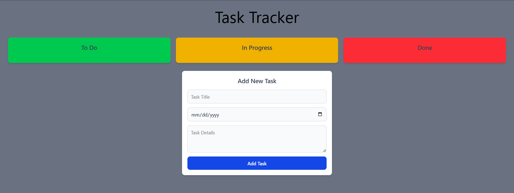

# Day 4: Task Tracker

**Description:**  Build out a Task Tracking app that allows you to enter tasks and track the progress.

***Here are the requirements that are needed:***
- Designed
- Created Elements
- Built in Vanilla JS
- Desktop Build
- Has fields that can be edited:
    - Task Name
    - Due Date
    - Task Summery
- Ability to Move Element between Statuses

**Developer:** Michael Heckerman

**Date Revised:** 2/14/25

## Link(s):

[Github-Repo](https://github.com/mkheck13/HeckermanMTaskTracker)

[Vercel](https://heckerman-m-task-tracker.vercel.app/)

